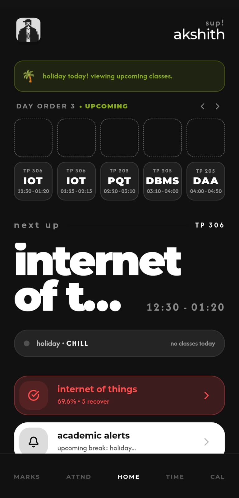
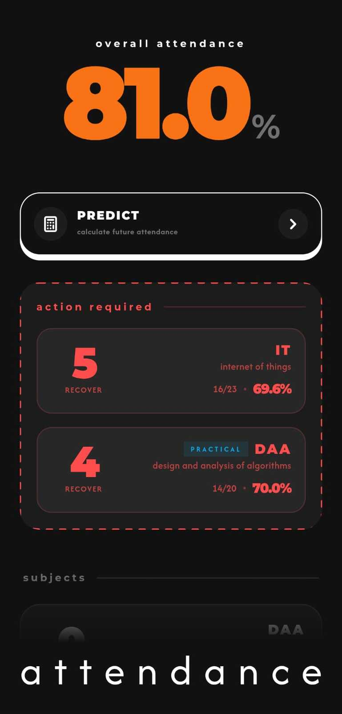

<div align="center">

**your academia portal, but it doesn't suck.**

[](https://nextjs.org)
[](https://fastapi.tiangolo.com)
[](https://typescriptlang.org)
[](https://python.org)
[](https://cloudflare.com)


&nbsp;&nbsp;


</div>

---

## what's this

ratio'd is a PWA dashboard for SRM students. the official academia portal is painfully slow, mobile unfriendly. ratio'd wraps it, scrapes the HTML, parses it into clean JSON, and serves it in an interface that doesn't make you want to close the tab immediately.

built by students. used by students. no data stored on our end.

---

## features

| feature | what it does |
|---|---|
| **sub-second sync** | background refresh keeps data fresh without interrupting you |
| **offline first** | schedule, marks, and attendance cached locally — works without wifi |
| **device-local encryption** | credentials encrypted with a non-exportable AES-256 key stored in your browser's secure key store |
| **dual themes** | minimalist or brutalist|
| **attendance predictor** | calculates exactly how many classes you can bunk and still survive |
| **marks target** | reverse engineers what you need in finals to hit your target grade |
| **live alerts** | class reminders, attendance dips, new marks — all as push notifications |
| **private notes** | per subject notes, stored locally, never synced anywhere |
 **session recovery** | auto handles expired sessions and concurrent login conflicts |

---

## architecture

```
students
   │
   ▼
cloudflare pages          ← static frontend (PWA)
   │
   ▼
cloudflare worker         ← proxy: HMAC signing, load balancing
   │
   ├──▶ server 1    ─┐
   ├──▶ server 2    ─┼─ fastapi backends
   └──▶ server 3    ─┘
              │
              ▼
       srm academia        ← the official portal
```

the worker sits between the frontend and all backends. it adds a cryptographic signature to every request so the backends can verify it actually came from ratio'd and not some random person. 

---

## stack

| layer | tech |
|---|---|
| frontend | Next.js 14, TypeScript, Tailwind CSS, Framer Motion |
| backend | Python, FastAPI, httpx, BeautifulSoup4 |
| proxy | Cloudflare Workers |
| hosting | Cloudflare Pages + Render |
| pwa | Workbox via `@ducanh2912/next-pwa` |
| auth | Web Crypto API, AES-GCM, IndexedDB |

---

## project structure

```
ratio-d/
├── src/
│   ├── app/              # next.js app router pages
│   ├── components/       # ui components (themes: minimalist, brutalist)
│   ├── context/          # app state, theme, layout context
│   ├── hooks/            # custom react hooks
│   ├── utils/            # logic: attendance, marks, encryption, api
│   └── types/            # typescript types
├── backend/
│   ├── core/             # session handling, academia client, config
│   ├── services/         # parsers: attendance, marks, timetable, profile
│   ├── models/           # pydantic schemas
│   └── main.py           # fastapi app, routes, middleware
├── worker/
│   ├── index.ts          # cloudflare worker: proxy + HMAC signing
│   └── wrangler.toml     # worker config
└── public/               # static assets, fonts, pwa icons
```

---

## setup

### prerequisites

- Node.js 18+
- Python 3.10+
- [Wrangler CLI](https://developers.cloudflare.com/workers/wrangler/) (for the worker)

---

### 1. clone

```bash
git clone https://github.com/projectakshith/ratio-d
cd ratio-d
```

---

### 2. backend

```bash
cd backend
python -m venv .venv
source .venv/bin/activate        # windows: .venv\Scripts\activate
pip install -r requirements.txt
uvicorn main:app --reload --port 8000
```

**backend env vars** — create `backend/.env`:

```env
HMAC_SECRET=your_secret_here     # must match the worker secret
ENV=development                  # set to "production" in prod
```

---

### 3. worker

```bash
cd worker
npm install -g wrangler
wrangler login

wrangler secret put HMAC_SECRET      # same value as backend
wrangler secret put BACKEND_URLS     # comma-separated: http://localhost:8000

wrangler dev                         # local dev
wrangler deploy                      # deploy to cloudflare
```

---

### 4. frontend

```bash
# from the root directory
npm install
npm run dev
```

**frontend env vars** — create `.env.local`:

```env
NEXT_PUBLIC_WORKER_URL=http://localhost:8787    # your worker URL (local or deployed)
```

> [!TIP]
> in local dev, run `wrangler dev` in the `worker/` directory first. it spins up on `localhost:8787` by default.

---

### 5. production env vars (Cloudflare Pages)

```env
NEXT_PUBLIC_WORKER_URL=https://your-worker.your-account.workers.dev
```

> [!NOTE]
> the frontend only needs one env var. all backend URLs and secrets are stored in the worker — never in the frontend bundle.

---

<details>
<summary><strong>how the encryption works</strong></summary>

<br>

when you log in, ratio'd generates an AES-256-GCM key using `window.crypto.subtle.generateKey` with `extractable: false`. this means:

- the key is stored as a `CryptoKey` object in IndexedDB
- **it cannot be exported or read by any JavaScript, including our own**
- the browser's engine enforces this at the native level

your credentials are encrypted with this key. the ciphertext goes in `localStorage`. without the key object (which never leaves your device's secure store), the ciphertext is useless.

if you clear your browser data, the key is gone — and so is everything ratio'd stored. that's the kill switch.

</details>

<details>
<summary><strong>how the HMAC signing works</strong></summary>

<br>

every request from the worker to a backend carries an `X-Ratio-Sig` header:

```
X-Ratio-Sig: t=1234567890,v1=<hmac-sha256>
```

the signature is `HMAC-SHA256(timestamp + "." + sha256(body), secret)`.

the backend verifies it and checks the timestamp is within ±5 minutes. requests without a valid signature are rejected with 403. the secret lives only in worker environment variables — it never touches the browser bundle.

</details>

---

## contributing

this is a student project so keep it chill. if you find a bug or want to add something:

1. fork it
2. branch off `dev` — `git checkout -b your-thing`
3. commit with conventional commits (`feat:`, `fix:`, `chore:`)
4. open a PR against `dev`, not `main`

> [!WARNING]
> don't commit `.env` files, don't hardcode secrets, don't push to `main` directly.

---

## disclaimer

ratio'd is not affiliated with SRM in any way. we don't own the portal, we don't store your data, we just make it less painful to look at. use it at your own risk, gng.

---

<div align="center">

⭐ star it if it saved your attendance

</div>
